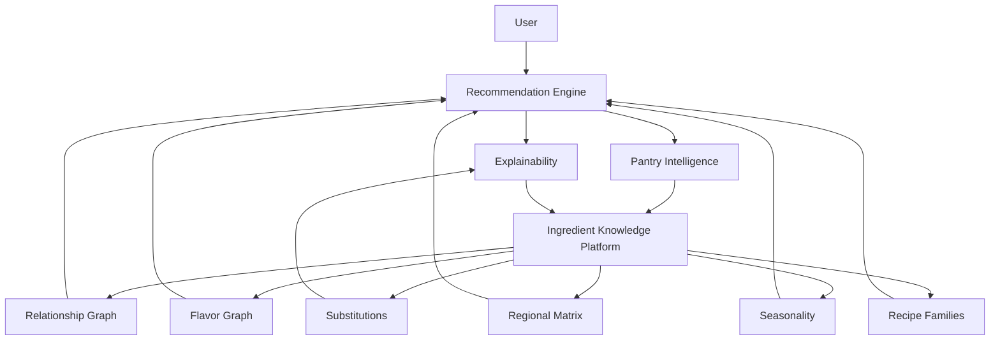

# Intelligence Flow



## ASCII Fallback

```text
User
↓
Recommendation Engine
↓
Explainability
↓
Pantry Intelligence
↓
Ingredient Knowledge Platform
↓
Relationship Graph
Flavor Graph
Regional Matrix
Seasonality
Substitutions
Recipe Families
```
